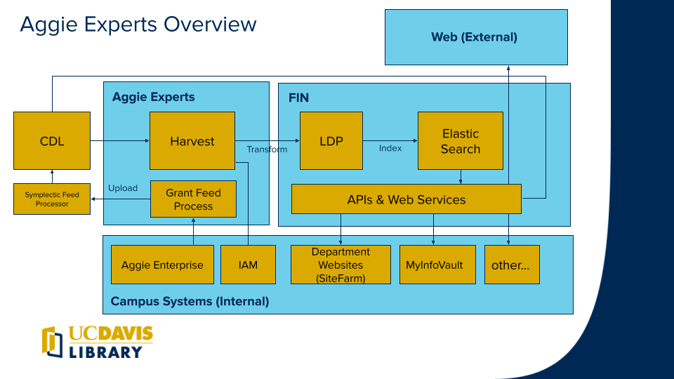

## Aggie Experts
Aggie Experts is a joint project between the Office of the Provost and the UC Davis Library. Its purpose is to create a central registry of UC Davis faculty, researchers, experts and creators and showcase the scholarship created at the university. Aggie Experts can be used as an expertise discovery platform for finding collaborators, mentors and expert opinions. If you have any recommendations, you can contact us by email or submit a request here.

## Conceptual Overview

- CDL - [The California Digital Library](https://cdlib.org/) hosts an instance of [Symplectic Elements](https://oapolicy.universityofcalifornia.edu) to facilitate [UC open access (OA) policies](https://osc.universityofcalifornia.edu/for-authors/open-access-policy/policy-faq/) 
- Harvest - Aggie Experts uses the [Harvest process](doc/harvest-process.md) to pull researchers, publications, and grants from the CDL using the [Symplectic API](https://support.symplectic.co.uk/support/solutions/folders/6000177986)
- [FIN](https://github.com/ucd-library/fin/blob/main/docs/README.md) - Fin is a microservice based Fedora repository (fcrepo) developed by the UCD Library. It provides services to support the LDP, HTTP APIs, authentication, and more.   
- LDP - Aggie Experts leverages FIN to store data in a [Fedora](https://wiki.lyrasis.org/display/FF/Fedora+Repository+Home) Linked Data Platform
- [Elastic Search](https://github.com/elastic/elasticsearch) - Aggie Experts creates [experts, works, and grant JSON-LD document](doc/digital_objects.org) indexes to support query and presentation of data.  
- Grant Processor - Grants are processed and imported into the CDL Elements instance via a process documented here: [Grant Feed Process](doc/grant-feed.md). The results of this process are transferred via the [Symplectic FTP](https://support.symplectic.co.uk/support/solutions/articles/6000271954-secure-ftp-server-access) service based scheduled jobs.
- APIs & Web Services - Campus departments and other partners may access and integrate researcher profiles using [FIN](https://github.com/ucd-library/fin/blob/main/docs/README.md) services. 
- [Aggie Enterprise](https://aggieenterprise.ucdavis.edu/) - Campus account system is a source for grant information in Aggie Experts
- [IAM](https://iet-ws.ucdavis.edu/iet-ws/#/home) - Aggie Experts harvester supplements reseacher profiles by accessing the Campus Identity Management API
- Department Websites - Campus websites using [SiteFarm](https://sitefarm.ucdavis.edu/) can enhance faculty pages by including profile and publications from Aggie Experts 
- [MyInfoVault](https://academicaffairs.ucdavis.edu/myinfovault) - UCD academics can import their publications from Aggie Experts reducing duplicate entry.

## Technical Overview

- Aggie Experts Code Development 
- [Docker Images and Deployment](doc/docker-deployment.md)
- Operation
- Process Descriptions
- APIs
- Data Standards and Ontologies

