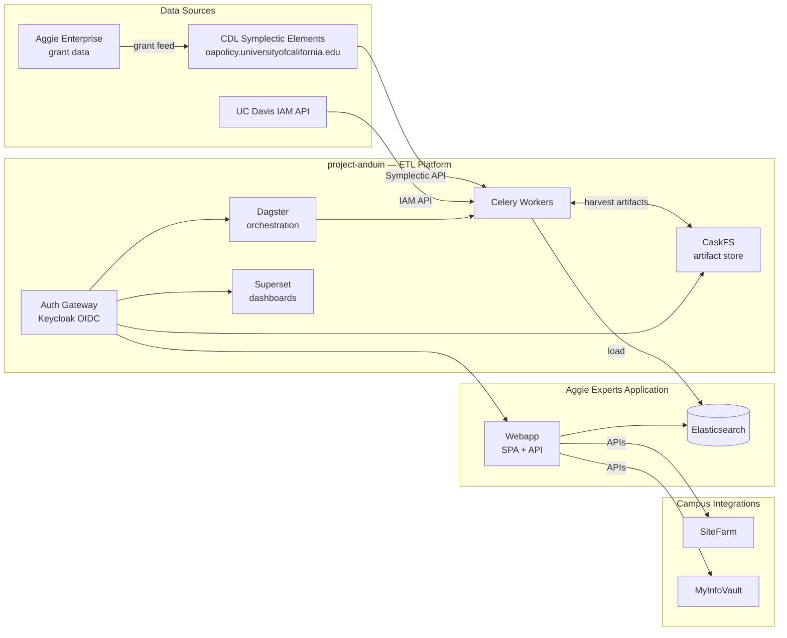

## Aggie Experts

Aggie Experts is a joint project between the Office of the Provost and the UC Davis Library.
Its purpose is to create a central registry of UC Davis faculty, researchers, experts, and
creators and showcase the scholarship created at the university. Aggie Experts can be used
as an expertise discovery platform for finding collaborators, mentors, and expert opinions.

```mermaid
flowchart LR
    subgraph Sources ["Data Sources"]
        CDL["CDL Symplectic Elements\noapolicy.universityofcalifornia.edu"]
        IAM["UC Davis IAM API"]
        AE_ENT["Aggie Enterprise\ngrant data"]
    end

    subgraph Anduin ["project-anduin — ETL Platform"]
        GW["Auth Gateway\nKeycloak OIDC"]
        DAG["Dagster\norchestration"]
        WORKERS["Celery Workers"]
        CASK["CaskFS\nartifact store"]
        SUP["Superset\ndashboards"]
    end

    subgraph AEApp ["Aggie Experts Application"]
        ES[("Elasticsearch")]
        WEBAPP["Webapp\nSPA + API"]
    end

    subgraph Campus ["Campus Integrations"]
        SF["SiteFarm"]
        MIV["MyInfoVault"]
    end

    AE_ENT -->|"grant feed"| CDL
    CDL -->|"Symplectic API"| WORKERS
    IAM -->|"IAM API"| WORKERS
    DAG --> WORKERS
    WORKERS <-->|"harvest artifacts"| CASK
    WORKERS -->|"load"| ES
    GW --> DAG & CASK & SUP & WEBAPP
    WEBAPP --> ES
    WEBAPP -->|"APIs"| SF & MIV
```

## Components

- **[CDL](https://cdlib.org/)** — The California Digital Library hosts an instance of
  [Symplectic Elements](https://oapolicy.universityofcalifornia.edu) to facilitate
  [UC open access policies](https://osc.universityofcalifornia.edu/for-authors/open-access-policy/policy-faq/).
  Aggie Experts pulls researcher profiles, publications, and grants from CDL using the
  [Symplectic API](https://support.symplectic.co.uk/support/solutions/folders/6000177986).

- **[project-anduin](https://github.com/ucd-library/project-anduin)** — The ETL platform
  hosting Dagster (workflow orchestration), CaskFS (artifact storage), Apache Superset
  (dashboards), and a Keycloak OIDC auth gateway. All harvest infrastructure runs inside
  Anduin.

- **[CaskFS](https://github.com/ucd-library/caskfs)** — Content-addressed file storage with
  a built-in RDF/linked-data layer. Stores all intermediate harvest artifacts
  (raw CDL data, AE standard JSON-LD, Elasticsearch-ready JSON-LD), backed by Google Cloud
  Storage.

- **[Elasticsearch](https://github.com/elastic/elasticsearch)** — Aggie Experts creates
  [expert, work, and grant JSON-LD document](doc/digital-objects.md) indexes to support
  query and presentation of data.

- **Webapp** — SPA and REST API serving the public-facing site and APIs. Powered by
  [Lit web components](https://lit.dev) and Express.

- **Grant Processor** — Grants originate in
  [Aggie Enterprise](https://aggieenterprise.ucdavis.edu/) and are imported into CDL
  Elements via the [Grant Feed Process](doc/grant-feed.md), making them available to the
  harvest.

- **[IAM](https://iet-ws.ucdavis.edu/iet-ws/#/home)** — The Campus Identity Management
  API supplements researcher profiles during harvest.

- **[SiteFarm](https://sitefarm.ucdavis.edu/)** — Campus department websites can enhance
  faculty pages by embedding profiles and publications from Aggie Experts.

- **[MyInfoVault](https://academicaffairs.ucdavis.edu/myinfovault)** — UCD academics can
  import their publications from Aggie Experts, reducing duplicate entry.

## Development and Operation How To's

- [Docker Images and Deployment](doc/docker-deployment.md)
- [Deployment repo](https://github.com/ucd-library/aggie-experts-deployment) — GitOps repo
  for dev (Kubernetes) and prod (Docker Compose) environments
- Process Descriptions
  - [Harvest Process](doc/harvest-process.md) — how data flows from CDL/IAM through CaskFS to Elasticsearch
  - [Anduin Integration](doc/anduin-integration.md) — ETL platform topology, auth, and custom gateway
  - [Dagster Harvest Workflow](doc/dagster-harvest-workflow.md) — asset/job/schedule reference
  - [Code and Data Deployment](doc/experts-deploy-harvest.md) — how to build, deploy, and run the ETL
  - [Process Weekly Grants](doc/grant-feed.md)
  - [Update Archived Grants](https://github.com/ucd-library/aggie_enterprise_kfs_grant_archive/blob/main/doc/KFS_Grant_Updates_howto.md)
- APIs
  - [FIN Data Models](https://github.com/ucd-library/fin/tree/main/docs/data-models)
- Data Standards and Ontologies
  - [Digital Objects](doc/digital-objects.md)
- Platform Docs
  - [project-anduin](https://github.com/ucd-library/project-anduin)
  - [CaskFS](https://github.com/ucd-library/caskfs)
