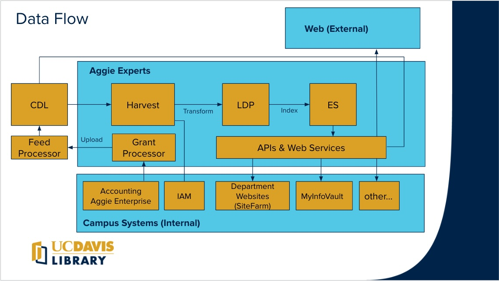

- CDL - The California Digital Library hosts an instance of [Symplectic Elements](https://www.symplectic.co.uk/theelementsplatform/)
- Harvest - Aggie Experts uses the [Harvest process](experts-deploy-harvest.md) to pull researchers, publications, and grants from the CDL using the Symplectic API
- LDP - Aggie Experts stores data in a [Fedora](https://wiki.lyrasis.org/display/FF/Fedora+Repository+Home) Linked Data Platform
- ES - Aggie Experts uses [Elastic Search](https://www.elastic.co/elasticsearch) to support query and presentation of experts, works, and grants.  
- Symplectic Feed Processor - Researcher, publications, and grants are imported into the CDL Elements system via the [Symplectic FTP](https://support.symplectic.co.uk/support/solutions/articles/6000271954-secure-ftp-server-access) service based scheduled jobs.
- Grant Processor - Grants are imported into Aggie Experts via a process documented here: [Grant Feed Process](grant-feed.md)
- APIs & Web Services - Campus departments and other partners may access and integrate data from Aggie Experts
- [Aggie Enterprise](https://aggieenterprise.ucdavis.edu/) - Campus account system is a source for grant information in Aggie Experts
- [IAM](https://iet-ws.ucdavis.edu/iet-ws/#/home) - Aggie Experts harvester supplements reseacher profiles by accessing the Campus Identity Management API
- Department Websites - Campus websites using [SiteFarm](https://sitefarm.ucdavis.edu/) can enhance faculty pages by including profile and publications from Aggie Experts 
- [MyInfoVault](https://academicaffairs.ucdavis.edu/myinfovault) - UCD academics can import their publications from Aggie Experts reducing duplicate entry.
