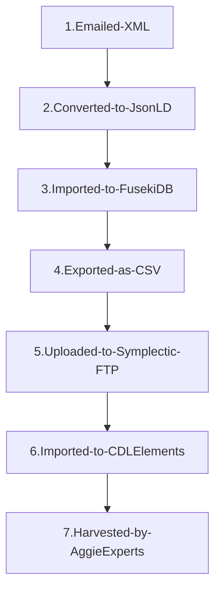

# Aggie Experts Grant Feed workflow

Updated: 02/2025 

UCD grants are imported into the CDL Elements system using the Symplectic Elements file upload feed mechanism.
Grant metadata originates from the UCD Aggie Enterprise system as a XML file received via a weekly email. A set of import files are created and uploaded to Sympletic for import into the CDL Elements instance. 

Most steps of the process are performed by the Aggie Experts CLI script at harvest/experts-client/bin/experts-grant-feed-process.

## Grant Data Import Steps

## Steps Descriptions  

1. Currently, a XML format file is received weekly from the Aggie Enterprise system. The file is generated by an Oracle report defined and scheduled using the Aggie Enterprise report interface. The file is uploaded to a GCS bucket in the Aggie Enterprise GCS project called aggie-enterprise. 
2. The CLI script [grant-feed-process](../harvest/experts-client/bin/experts-grant-feed-process.js) retrieves the XML file and transforms it into a JsonLd file.
3. The resulting JsonLd file is posted to the Fuseki instance which is a container in the Aggie Experts cluster.
4. The CSV file are generated using Sparql queries. See: ([Grant Feed Sparql Query](../harvest/experts-client/lib/query/grant_feed/grants.rq)). The set of CSV output files (metadata, links, and persons) is produced and compared to the previous generation (result of the last product of this process) to derive delta set that only contains grant additions and updates. The delta set of CVS file are uploaded to Symplectic to be imported via the nightly process.
5. ftp.use.symplectic.org 
username: ucdavis
password: [retreived from GCS Secret Manager] (https://console.cloud.google.com/security/secret-manager?project=aggie-experts)
Note that directories have been created on the Symplectic FTP server under the ucdavis account for QA and PROD. These directories also contain LOGS of import results for debugging purposes.
6. A scheduled job (nightly) on the Symplectic server imports the grants, links to users, and related persons into the CDL Elements database. 
7. The imported grants will now be included when harvest queries are executed against the CDL Elements instance. 

## Legacy KFS Grant Feed Workflow

A workflow to load legacy grants from KFS into CDL Elements.

A subset of the grants present in the KFS system have been designated as legacy.
They will not be carried over to the new Aggie Enterpise system. The legacy grants are loaded into CDL Elements using the Symplectic Elements feed mechanism. This set of grants is managed in a separate GitHub project [here] (https://github.com/ucd-library/aggie_enterprise_kfs_grant_archive). Sometimes a KFS grant needs to be deleted from Aggie Experts or modified in some way. The KFS Grant Archive project contains directories of incremental updates for this purpose. See that project's doc directory for more details. 

### Three csv files are uploaded to the Symplectic server:
#### Prod_UCD_grants_metadata.csv for grant metadata
#### Prod_UCD_grants_links.csv for linking Elements users to grants with roles.
#### Prod_UCD_grants_persons.csv for linking persons who are not Elements users. We use this to include Co-PIs that are not in the Elements system.

#### Columns of the grant import file are:

|field|format|notes|
|-----|------|-----|
|id|Ark ID|ARK identifier used by Aggie Experts|
|category|text|Default to "grant"|
|type|text|The grant type as defined in Elements."c-ucdavis-pre-ae" for archived (KFS) grants. "c-ucd-enterprise" for Aggie Enterprise managed grants|
|title|text| Grant title|
|c-pi|text|Principle Investigator|
|funder-name|text||
|funder-reference|text|Funder ID|
|start-date|YYYY-MM-DD|Grant start date|
|end-date| YYYY-MM-DD|Grant end date|
|amount-value|number|USD amount|
|amount-currency-code|currency type|USD|
|funding-type|text| Research, Service/Other, Instruction,   |
|c-ucop-sponsor|http:/rems.ucop.edu/sponsor/[CODE]|URL with valid REMS sponsor code|
|c-flow-thru-funding|http:/rems.ucop.edu/sponsor/[CODE]|URL with valid REMS sponsor code| 
|visible|true/false|Determines whether matching records ... |

These column names correspond to the grant data "underlying fields" in the Symplectic Elements system.
Values are mapped to matching fields in the CDL Elements system in the Grants table.
Note that custom underlying fields can be added to the CDL Elements system to capture additional grant data.
See "Manage underlying fields: grant" in the Symplectic Elements documentation for more information.

#### Column names for the links file are

|field|format|notes|
|-----|------|-----|
|category-1|text|Default to "user"|
|id-1|number|CDL Elements user ID|
|category-2|text|Default to "grant"|
|id-2|ARK ID|ARK ID of grant|
|link-type-id|number|Relationship type code|
|visible|true/false|Determines whether matching  **NOT SUPPORTED |

#### Column names for the persons file are

|field|format|notes|
|-----|------|-----|
|category|text|Default to "grant" |
|id|number|Ark format ID of grant|
|field-name|text|field to apply value to|
|surname|text|last name of related person|
|first-name|text|first name of related person|
|full-name|text|full name of related person|

### Sparql Queries  
The CSV file are generated using Sparql queries.
see: ([Grant Feed Sparql Query](../harvest/experts-client/lib/query/grant_feed/grants.rq))

