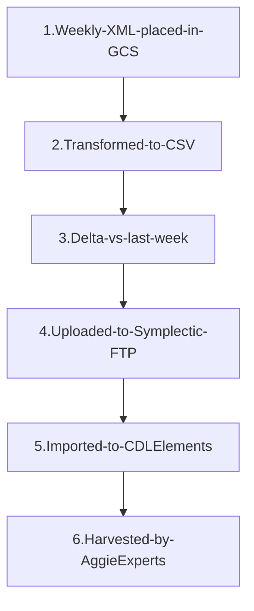

# Aggie Experts Grant Feed workflow

UCD grants are imported into the CDL Elements system using the Symplectic
Elements file-upload feed mechanism. Grant metadata originates from the UCD
Aggie Enterprise system as an XML file received via a weekly email. A set of
import (delta) CSV files is produced and uploaded to Symplectic for import into
the CDL Elements instance.

The pipeline is a pure-JS ETL in `harvest/` (no Fuseki/SPARQL) and stores every
artifact in CasKFS under the weekly partition, alongside the rest of the harvest
ETL. It is orchestrated by Dagster.

> This is the **Aggie Enterprise → Symplectic** grant feed. It is a different
> pipeline from the webapp *grant* documents (works + grants shown on the site);
> see the `grant` scholarly-work assets for that.

> **Ingest is currently manual (security hold).** The automated email-check
> that would poll the inbox and auto-trigger the ETL is **on hold** — its
> Dagster asset/job/schedules are defined but not registered (see
> `dagster/defs.py`). Until it is re-enabled, place the weekly XML in the GCS
> bucket by hand and run the ETL yourself (CLI or Dagster — see "Running it").

## Grant Data Import Steps

```mermaid
graph TD;
    1.Weekly-XML-placed-in-GCS-->2.Transformed-to-CSV;
    2.Transformed-to-CSV-->3.Delta-vs-last-week;
    3.Delta-vs-last-week-->4.Uploaded-to-Symplectic-FTP;
    4.Uploaded-to-Symplectic-FTP-->5.Imported-to-CDLElements;
    5.Imported-to-CDLElements-->6.Harvested-by-AggieExperts
```
## Step Descriptions

1. A weekly XML extract (attachment `AEgrants.xml`) is emailed from
   `aggieenterprise@ucdavis.edu`, generated by an Oracle report in the Aggie
   Enterprise report interface. **Download it and upload it by hand** to the
   `gs://aggie-enterprise/grants/ae-grants.xml` bucket location (overwriting the
   previous version), then kick off the ETL. *(When the email-check hold is
   lifted, a scheduled Dagster job will do this staging + triggering
   automatically.)*
2. **transform** — [transform.js](../harvest/lib/grant-feed/transform.js) parses
   the XML and builds the three Symplectic CSVs (metadata, links, persons) for
   the week, stored under `/weekly/<year-week>/grant-feed/`.
3. **delta** — this week's generation is compared to the **most-recent prior**
   cached generation (usually last week; a week with no run is stepped over) to
   derive the delta set: grant additions/updates, link changes, and links to
   delete. `--prev-date <YYYY-MM-DD>` forces a specific comparison week. On the
   first-ever run (no prior generation) everything is treated as new (a full
   initial load).
4. **upload** — the delta CSVs are read from CasKFS and SFTP-uploaded to
   Symplectic for import via the nightly process.
5. Symplectic FTP: `ftp.use.symplectic.org`, username `ucdavis`, password is retrieved from GCS Secret Manager
   (`Symplectic-Elements-FTP-ucdavis-password`). Directories exist on the
   Symplectic FTP server under the `ucdavis` account for QA and PROD; these also
   contain LOGS of import results for debugging.
6. A scheduled nightly job on the Symplectic server imports the grants, user
   links, and related persons into the CDL Elements database.
7. The imported grants are then included when harvest queries run against the
   CDL Elements instance.

All artifacts live in CasKFS under the weekly partition:

```
/weekly/<year-week>/grant-feed/
    ae-grants.xml                # raw input
    grants-metadata.csv          # this week's full generation
    grants-links.csv
    grants-persons.csv
    delta/
        grants-metadata.csv      # what gets sent to Symplectic
        grants-links.csv
        grants-persons.csv
        delete-user-grants-links.csv
```

CasKFS filenames follow the project convention — lower-case and hyphens only.
The legacy Symplectic names (`Prod_UCD_grants_metadata.csv`, underscores, mixed
case) are applied only on upload, so the cache stays clean while Symplectic
still receives the names its importer expects. (QA uses the `QA_UCD_` prefix,
e.g. `QA_UCD_grants_metadata.csv`, delivered to the `/QA/` directory.)

Weekly cleanup (`purge_year_week_cask_files`) removes old `/weekly/<year-week>`
trees, including the grant feed, automatically. On completion the ingest posts a
Slack notification (success/failure + grant count) to the harvest-messages
channel.

Two ways to run it (after placing the week's `ae-grants.xml` in the GCS bucket):

**Option A — CLI:**
```
$ experts harvest grant-feed process --env PROD     # PROD -> /PROD/, Prod_UCD_ names
$ experts harvest grant-feed process --env QA       # QA   -> /QA/,   QA_UCD_ names
```
By default it pulls the XML from `config.grantFeed.inputXml`
(`gs://aggie-enterprise/grants/ae-grants.xml`), uploads the delta to Symplectic,
and loads the reporting DB. Add `--no-upload` to produce/store the delta without
sending it; pass `--date YYYY-MM-DD` to target another week; pass
`--xml <path|gs://…>` to override the input.

**Option B — Dagster:** launch the `grant_feed_job` (runs the `grant_feed_ingest`
asset), or from the CLI:
```
$ experts harvest dagster run-grant-feed-job --env PROD
$ experts harvest dagster run-grant-feed-job --env QA
```
Uploads to PROD unless the run is tagged `symplectic_env=QA` (which
`--env QA` sets).

Both paths diff this week's generation against the **most-recent prior cached
generation** in CasKFS (usually last week; a week with no run is stepped over,
and `--prev-date <YYYY-MM-DD>` forces a specific comparison week). Both post a
Slack notification (success/failure + grant count) to the harvest-messages
channel. Weekly cleanup (`purge_year_week_cask_files`) removes old
`/weekly/<year-week>` trees automatically.

### Individual steps

```
$ experts harvest grant-feed transform --xml gs://…   # XML -> generation CSVs
$ experts harvest grant-feed delta                     # this week vs last week
```

### Automated email trigger — ON HOLD

The email-check that would poll the inbox and auto-trigger the ETL is **disabled
for security reasons**. The code is preserved but **not registered** in
`dagster/defs.py`:
- asset `check_grant_feed_email` (`dagster/lib/assets.py`)
- job `grant_feed_email_job` (`dagster/lib/jobs.py`)
- schedules `grant_feed_email_schedule_prod|dev` (`dagster/lib/schedules.py`)
- CLI `experts harvest grant-feed check-email` + [email.js](../harvest/lib/grant-feed/email.js)

Re-enable by uncommenting the imports and registrations in `dagster/defs.py`
(and, when the mailbox is provisioned, implementing the concrete client in
`email.js` and setting the `EXPERTS_GRANT_FEED_EMAIL_*` env vars in
[config.js](../commons/lib/config.js)).

## Import confirmation (Symplectic logs)

Symplectic processes our upload on a schedule (~1 day later) and writes logs to
the SFTP server under `PROD/Logs/` and `QA/Logs/`. A daily Dagster job
(`grant_feed_logs_schedule_*` → `grant_feed_logs_job` → `fetch_grant_feed_logs`),
or the CLI, pulls these and confirms whether what we sent was imported/deleted:

```
$ experts harvest grant-feed fetch-logs --env PROD [--date YYYY-MM-DD]
```

It fetches three feeds (env-specific folder names — see
`config.grantFeed.symplectic.logs`), keeps only the **meaningful** ones in
CasKFS under `/weekly/<year-week>/grant-feed/symplectic-logs/<env>/`, and loads
the confirmation into the reporting schema:

| log | meaningful when | reporting |
|---|---|---|
| grants-feed (Summary/Import_Successes/Import_Errors) | ≥1 item processed | `import_result` (per-grant created/updated/failed + reason), `import_summary` (run totals) |
| delete-user-links (notes) | ≥1 per-link outcome | sets `delete_links.delete_status` (`deleted`/`not-found`) + `date_confirmed`; counts in `import_summary` |
| delete-grant-records (notes) | ≥1 record deleted | **archived to CasKFS only** — this is the KFS legacy archive (`ark:/…/d7gt0q/…`), not our AE feed |

Logs with nothing meaningful (e.g. "0 items processed" on a day Symplectic
hasn't processed our file) are not written. Correlation is by grant ARK →
`grant_id` (+ env); the confirmation's `year_week` is the log date's — usually,
but not always, the same week as the upload. The reporting load is best-effort
(a DB failure is logged, not fatal). The Dagster log-fetch is **not** under the
email-check security hold (the logs are our own output, not the sensitive
input).

## Import file formats

Three CSV files (plus a delete file) are uploaded to the Symplectic server:

- `Prod_UCD_grants_metadata.csv` — grant metadata
- `Prod_UCD_grants_links.csv` — links Elements users to grants with roles
- `Prod_UCD_grants_persons.csv` — persons who are not Elements users (e.g. Co-PIs
  not in the Elements system)
- `Prod_UCD_delete_user_grants_links.csv` — user↔grant links that vanished and
  should be removed

#### Columns of the grant metadata file are:

|field|format|notes|
|-----|------|-----|
|id|Ark ID|ARK identifier used by Aggie Experts|
|category|text|Default to "grant"|
|type|text|The grant type as defined in Elements. "c-ucdavis-pre-ae" for archived (KFS) grants. "c-ucd-enterprise" for Aggie Enterprise managed grants|
|title|text| Grant title|
|c-pi|text|Principle Investigator|
|funder|text||
|funder-reference|text|Funder ID|
|start-date|YYYY-MM-DD|Grant start date|
|end-date| YYYY-MM-DD|Grant end date|
|amount-value|number|USD amount|
|amount-currency-code|currency type|USD|
|funding-type|text| Research, Service/Other, Instruction,   |
|c-ucop-sponsor|http://rems.ucop.edu/sponsor/[CODE]|URL with valid REMS sponsor code|
|c-flow-thru-funding|http://rems.ucop.edu/sponsor/[CODE]|URL with valid REMS sponsor code|
|visible|true/false|Determines whether matching records ... |

These column names correspond to the grant data "underlying fields" in the
Symplectic Elements system. Values are mapped to matching fields in the CDL
Elements system in the Grants table. Note that custom underlying fields can be
added to the CDL Elements system to capture additional grant data. See "Manage
underlying fields: grant" in the Symplectic Elements documentation for more
information.

#### Column names for the links file are

|field|format|notes|
|-----|------|-----|
|category-1|text|Default to "user"|
|id-1|number|CDL Elements user ID|
|category-2|text|Default to "grant"|
|id-2|ARK ID|ARK ID of grant|
|link-type-id|number|Relationship type code|
|visible|true/false|Determines whether matching  **NOT SUPPORTED |

#### Column names for the persons file are

|field|format|notes|
|-----|------|-----|
|category|text|Default to "grant" |
|id|number|Ark format ID of grant|
|field-name|text|field to apply value to|
|surname|text|last name of related person|
|first-name|text|first name of related person|
|full-name|text|full name of related person|

The CSVs are produced directly in JS; the SPARQL/field mapping rules from the
old Fuseki pipeline are encoded in
[transform.js](../harvest/lib/grant-feed/transform.js).

## Legacy KFS Grant Feed Workflow

A workflow to load legacy grants from KFS into CDL Elements.

A subset of the grants present in the KFS system have been designated as legacy.
They will not be carried over to the new Aggie Enterprise system. The legacy
grants are loaded into CDL Elements using the Symplectic Elements feed mechanism.
This set of grants is managed in a [separate GitHub project](https://github.com/ucd-library/aggie_enterprise_kfs_grant_archive).
Sometimes a KFS grant needs to be deleted from Aggie Experts or modified in some
way. The KFS Grant Archive project contains directories of incremental updates
for this purpose. See that project's doc directory for more details.
