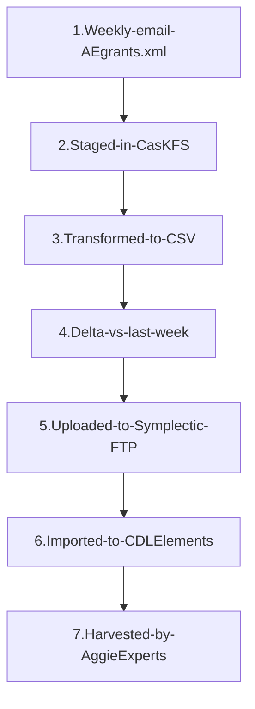

# Aggie Experts Grant Feed workflow

UCD grants are imported into the CDL Elements system using the Symplectic
Elements file-upload feed mechanism. Grant metadata originates from the UCD
Aggie Enterprise system as an XML file received via a weekly email. A set of
import (delta) CSV files is produced and uploaded to Symplectic for import into
the CDL Elements instance.

The pipeline is a pure-JS ETL in `harvest/` (no Fuseki/SPARQL) and stores every
artifact in CasKFS under the weekly partition, alongside the rest of the harvest
ETL. It is orchestrated by Dagster.

> This is the **Aggie Enterprise → Symplectic** grant feed. It is a different
> pipeline from the webapp *grant* documents (works + grants shown on the site);
> see the `grant` scholarly-work assets for that.

## Grant Data Import Steps

```mermaid
graph TD;
    1.Weekly-email-AEgrants.xml-->2.Staged-in-CasKFS;
    2.Staged-in-CasKFS-->3.Transformed-to-CSV;
    3.Transformed-to-CSV-->4.Delta-vs-last-week;
    4.Delta-vs-last-week-->5.Uploaded-to-Symplectic-FTP;
    5.Uploaded-to-Symplectic-FTP-->6.Imported-to-CDLElements;
    6.Imported-to-CDLElements-->7.Harvested-by-AggieExperts
```
## Step Descriptions

1. A weekly XML extract (attachment `AEgrants.xml`) is emailed from
   `aggieenterprise@ucdavis.edu`. The file is generated by an Oracle report
   defined and scheduled in the Aggie Enterprise report interface. A **daily**
   Dagster schedule (`grant_feed_email_schedule_*`) checks the inbox; when a new
   file arrives it is staged in CasKFS at
   `/weekly/<year-week>/grant-feed/AEgrants.xml` and the ETL is triggered.
   *(Historically the file was uploaded by hand to the `gs://aggie-enterprise/grants`
   bucket; that still works as a manual `--xml` override — see below.)*
2. **transform** — [transform.js](../harvest/lib/grant-feed/transform.js) parses
   the XML and builds the three Symplectic CSVs (metadata, links, persons) for
   the week, stored under `/weekly/<year-week>/grant-feed/`.
3. **delta** — this week's generation is compared to **last week's** cached
   generation to derive the delta set: grant additions/updates, link changes,
   and links to delete. On the first-ever run everything is treated as new (a
   full initial load).
4. **upload** — the delta CSVs are read from CasKFS and SFTP-uploaded to
   Symplectic for import via the nightly process.
5. Symplectic FTP: `ftp.use.symplectic.org`, username `ucdavis`, password is retrieved from GCS Secret Manager
   (`Symplectic-Elements-FTP-ucdavis-password`). Directories exist on the
   Symplectic FTP server under the `ucdavis` account for QA and PROD; these also
   contain LOGS of import results for debugging.
6. A scheduled nightly job on the Symplectic server imports the grants, user
   links, and related persons into the CDL Elements database.
7. The imported grants are then included when harvest queries run against the
   CDL Elements instance.

All artifacts live in CasKFS under the weekly partition:

```
/weekly/<year-week>/grant-feed/
    AEgrants.xml                         # raw input
    Prod_UCD_grants_metadata.csv         # this week's full generation
    Prod_UCD_grants_links.csv
    Prod_UCD_grants_persons.csv
    delta/
        Prod_UCD_grants_metadata.csv     # what gets sent to Symplectic
        Prod_UCD_grants_links.csv
        Prod_UCD_grants_persons.csv
        Prod_UCD_delete_user_grants_links.csv
```

Weekly cleanup (`purge_year_week_cask_files`) removes old `/weekly/<year-week>`
trees, including the grant feed, automatically. On completion the ingest posts a
Slack notification (success/failure + grant count) to the harvest-messages
channel.

### Full ETL (transform + delta + upload)

```
$ experts harvest grant-feed process --env PROD
```

By default this uploads the delta to Symplectic. Add `--no-upload` to produce
and store the delta without sending it. It processes the current week; pass
`--date YYYY-MM-DD` to target another week.

### Individual steps

```
$ experts harvest grant-feed transform --env PROD          # XML -> generation CSVs
$ experts harvest grant-feed delta     --env PROD          # this week vs last week
$ experts harvest grant-feed check-email                   # poll inbox, stage input
```

### Input source

`transform` (and `process`) resolve the XML in this order:

1. `--xml <path|gs://…>` — an explicit override: a local path or a
   `gs://bucket/path/file.xml` URI (e.g.
   `gs://aggie-enterprise/grants/ae-grants.xml`). The file is also archived into
   CasKFS as the week's `AEgrants.xml`. GCS access uses Application Default
   Credentials (`GOOGLE_APPLICATION_CREDENTIALS` or `gcloud auth
   application-default login`).
2. Otherwise, the `AEgrants.xml` already staged in CasKFS for the week (written
   by `check-email`).

To run a week manually from a file you have on hand:

```
$ experts harvest grant-feed process --env PROD --xml ./AEgrants.xml
```

### Email trigger status

The receiving mailbox has **not been provisioned yet**, so the email backend is
a stub (`config.grantFeed.email.enabled = false`) and `check_grant_feed_email`
is a safe daily no-op. Until the address exists, stage input manually by running
`process`/`transform` with `--xml`. Once the mailbox and provider (IMAP /
Microsoft Graph / Gmail) are chosen, implement the client in
[email.js](../harvest/lib/grant-feed/email.js) and set the
`EXPERTS_GRANT_FEED_EMAIL_*` environment variables (see
[config.js](../commons/lib/config.js)).

## Import file formats

Three CSV files (plus a delete file) are uploaded to the Symplectic server:

- `Prod_UCD_grants_metadata.csv` — grant metadata
- `Prod_UCD_grants_links.csv` — links Elements users to grants with roles
- `Prod_UCD_grants_persons.csv` — persons who are not Elements users (e.g. Co-PIs
  not in the Elements system)
- `Prod_UCD_delete_user_grants_links.csv` — user↔grant links that vanished and
  should be removed

#### Columns of the grant metadata file are:

|field|format|notes|
|-----|------|-----|
|id|Ark ID|ARK identifier used by Aggie Experts|
|category|text|Default to "grant"|
|type|text|The grant type as defined in Elements. "c-ucdavis-pre-ae" for archived (KFS) grants. "c-ucd-enterprise" for Aggie Enterprise managed grants|
|title|text| Grant title|
|c-pi|text|Principle Investigator|
|funder name|text||
|funder-reference|text|Funder ID|
|start-date|YYYY-MM-DD|Grant start date|
|end-date| YYYY-MM-DD|Grant end date|
|amount-value|number|USD amount|
|amount-currency-code|currency type|USD|
|funding-type|text| Research, Service/Other, Instruction,   |
|c-ucop-sponsor|http:/rems.ucop.edu/sponsor/[CODE]|URL with valid REMS sponsor code|
|c-flow-thru-funding|http:/rems.ucop.edu/sponsor/[CODE]|URL with valid REMS sponsor code|
|visible|true/false|Determines whether matching records ... |

These column names correspond to the grant data "underlying fields" in the
Symplectic Elements system. Values are mapped to matching fields in the CDL
Elements system in the Grants table. Note that custom underlying fields can be
added to the CDL Elements system to capture additional grant data. See "Manage
underlying fields: grant" in the Symplectic Elements documentation for more
information.

#### Column names for the links file are

|field|format|notes|
|-----|------|-----|
|category-1|text|Default to "user"|
|id-1|number|CDL Elements user ID|
|category-2|text|Default to "grant"|
|id-2|ARK ID|ARK ID of grant|
|link-type-id|number|Relationship type code|
|visible|true/false|Determines whether matching  **NOT SUPPORTED |

#### Column names for the persons file are

|field|format|notes|
|-----|------|-----|
|category|text|Default to "grant" |
|id|number|Ark format ID of grant|
|field-name|text|field to apply value to|
|surname|text|last name of related person|
|first-name|text|first name of related person|
|full-name|text|full name of related person|

The CSVs are produced directly in JS; the SPARQL/field mapping rules from the
old Fuseki pipeline are encoded in
[transform.js](../harvest/lib/grant-feed/transform.js).

## Legacy KFS Grant Feed Workflow

A workflow to load legacy grants from KFS into CDL Elements.

A subset of the grants present in the KFS system have been designated as legacy.
They will not be carried over to the new Aggie Enterprise system. The legacy
grants are loaded into CDL Elements using the Symplectic Elements feed mechanism.
This set of grants is managed in a [separate GitHub project](https://github.com/ucd-library/aggie_enterprise_kfs_grant_archive).
Sometimes a KFS grant needs to be deleted from Aggie Experts or modified in some
way. The KFS Grant Archive project contains directories of incremental updates
for this purpose. See that project's doc directory for more details.
