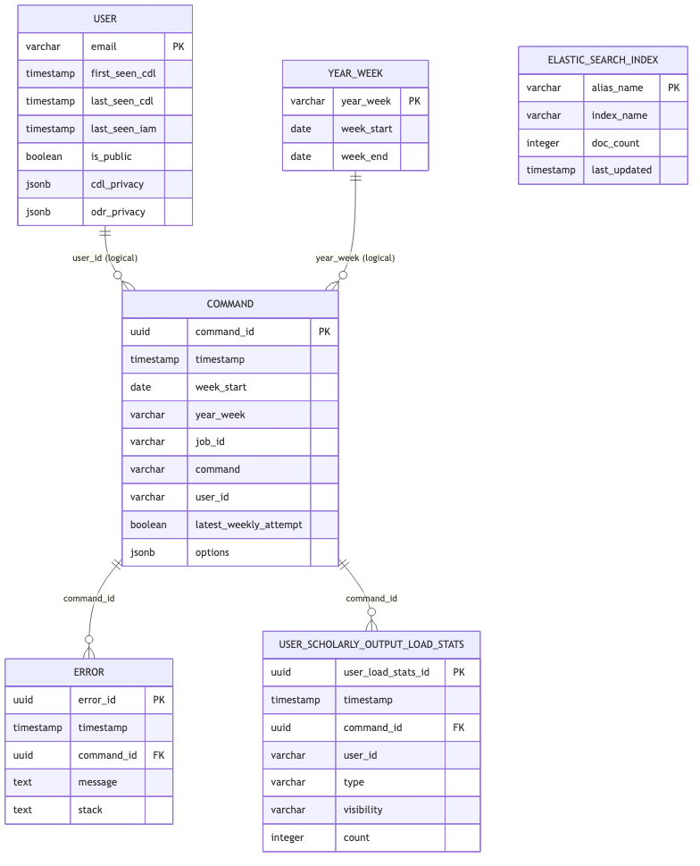

# Reporting Database ERD

Schema source: [`harvest/lib/reporting/schema.sql`](../harvest/lib/reporting/schema.sql)

## Views

- `command_error` — joins command attempts with captured errors, including a Dagster run link.
- `user_command_weekly_stats` — per-user, per-command weekly status (`ok`, `error`, `no_attempt`) using the latest weekly attempt.
- `this_week_user_state_count` — aggregates each user’s overall ETL state for the current week.
- `user_command_weekly_state_changes` — compares each command’s state to the previous week and labels change/no-change.
- `this_week_user_state_changes` — current-week view of per-user command state changes.
- `user_scholarly_output_weekly_changes` — week-over-week delta of scholarly output counts by user, type, and visibility.
- `this_week_user_scholarly_output_changes` — current-week subset of scholarly output deltas.
- `user_left_this_week` — users seen in the previous week but not this week (based on CDL/IAM last-seen dates).
- `this_week_harvest_errors` — current-week latest-attempt command failures with localized timestamps.

## Notes

- Solid foreign keys in schema:
  - `error.command_id -> command.command_id`
  - `user_scholarly_output_load_stats.command_id -> command.command_id`
- Logical (non-constrained) joins used by reporting views/functions:
  - `command.user_id <-> user.email`
  - `command.year_week <-> year_week.year_week`
- `elastic_search_index` is standalone in this schema.
