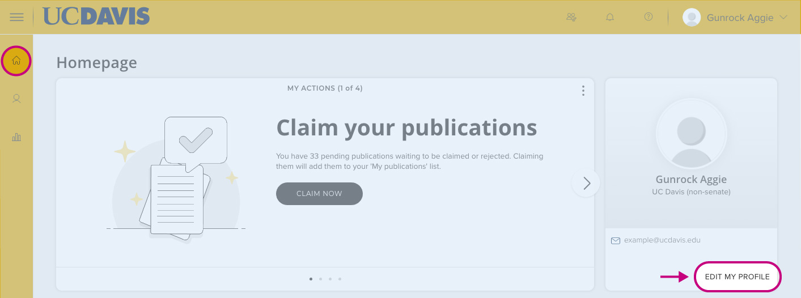
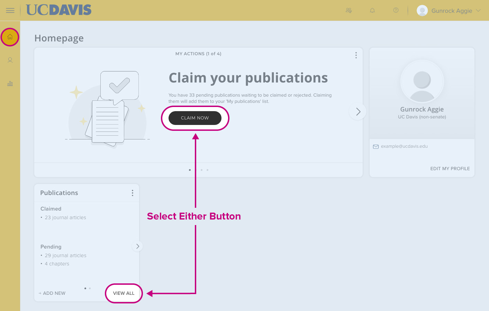
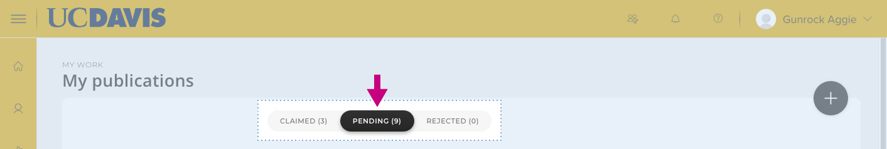
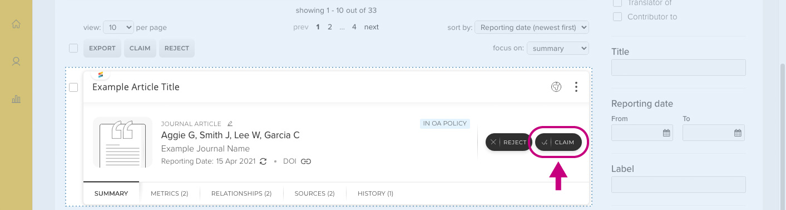
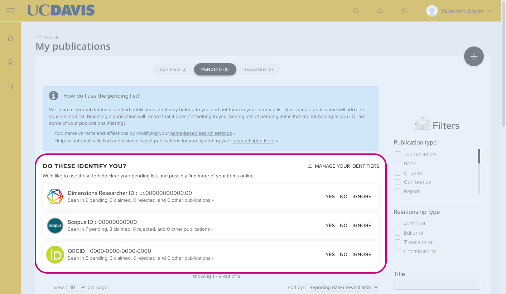

## About Aggie Experts {#about-aggie-experts}

### What is Aggie Experts? {#what-is-aggie-experts}
Aggie Experts is a platform for finding researchers and experts at UC Davis. A pilot project led jointly by the Office of the Provost and the UC Davis Library, it is designed to facilitate interdisciplinary collaboration, showcase the research being done at the university, and reduce administrative workload for faculty. Aggie Experts can be used to find collaborators, mentors and expert opinions.

### How does search work on Aggie Experts? {#how-does-search-work-on-aggie-experts}
Aggie Experts' default search will look for matches of **all keywords** in titles of works and grants, in abstracts of grants, experts' bios, affiliations, and journal and publisher names.

You can use [search operators](/search-tips) to change the way Aggie Experts delivers search results.

### I am faculty at UC Davis. Why am I not in Aggie Experts? {#why-am-i-not-in-aggie-experts}
Aggie Experts includes Academic Senate and Federation faculty and researchers. If you are a current member of the Academic Senate or Federation and you do not see your profile, please [contact us](mailto:experts@ucdavis.edu).

### How often do you update the data in Aggie Experts? {#how-often-do-you-update-the-data}
We currently update the scholarly publications data weekly. Grants data are updated quarterly.

### What sources do you use for my publications? {#what-sources-do-you-use-for-my-publications}
We are using the [UC Publication Management System](https://oapolicy.universityofcalifornia.edu/) as the primary source of publications. It aggregates records of UC Davis authors from Dimensions, Scopus, Crossref, Web of Science (Lite), Europe PubMed Central, PubMed, eScholarship, arXiv, RePEc, SSRN, DBLP, CiNii EN, CiNii JP, figshare.com (limited) and Google Books. At this time only journal articles, books, book chapters, and conference papers are included in Aggie Experts. Visit our [library guide](https://guides.library.ucdavis.edu/open-access-publishing/ucpms) for tips on how to login and manage your publications in the UC Publication Management System.

### What sources do you use for my grants? Why can't I edit the grant records? {#what-sources-do-you-use-for-my-grants}
We receive grant data from the university's financial warehouse. They have been reconciled with UCOP records of awards to UC Davis and are considered the official university record. As such, they cannot be edited directly. If information is displaying improperly in Aggie Experts (for example, a grant title getting cut off that is longer than the default character count), please [contact us](mailto:experts@ucdavis.edu) for assistance. For changes to other information about a grant, please contact your unit's finance office.

## Managing Your Profile {#managing-your-profile}

### How do I export data? {#how-do-i-export-data}
{{ifLoggedIn}}
In the Publications section of your profile, you will find a Download icon to export publications as an RIS file. This file can be used in citation management systems, such as Zotero.

If you want to download individual publications, click the Edit icon. The new page will allow you to select individual publications, which you can then download by clicking the Download button. Grants can be similarly exported in a spreadsheet.
{{else}}
You must be logged in to view this information.
{{/ifLoggedIn}}

### How do I edit my Aggie Experts profile? {#how-do-i-edit-my-aggie-experts-profile}
What you see as your entry is a merging of several university-vetted data sources, so data editing requires logging into the original data source systems. Check the instructions below for editing your [name/title/affiliation](#change-bio) and [publication record](#change-pub) on this help page.

### How do I change my name/title/affiliation? {#change-bio}
Your name, title and affiliation appear as they are shown in the UC Davis online directory or in UCPath.

- To change your name, go to the [Personal Information Summary in UCPath](https://ucpath.universityofcalifornia.edu/personal-information/personal-information-summary) and click on the drop-down menu in Legal Name / Name. Click on the tab with your name. Once directed to the new page, select Edit Legal Name/ Name. Scroll to the second half of the page to edit how your name appears. This is a separate set of fields from your legal name - **do not edit your legal name**. At the bottom of the page first click on Refresh Name to preview, and then on OK.
- To change your title, update the [campus directory](https://org.ucdavis.edu/odr/) listing. Once the changes are approved by directory administrators, they will be reflected in Aggie Experts at the next update. More information on the UC Davis Directory can be found [here](https://org.ucdavis.edu/directory/index.html). If you are not able to change the information already in the directory, you will need to contact HR.

### How do I add more information to what you already have in Aggie Experts? {#add-more-info}
Most data in Aggie Experts is imported from other university sources. Changing and updating the data in them is addressed in separate questions, e.g., "[How do I change my name/title/affiliation](#change-bio)" and "[How do I edit my publication record](#change-pub)."

To add an introduction and more websites to the "About Me" section of your profile, click on the Edit icons. You will be redirected to log into your UC Publication Management System [account](https://oapolicy.universityofcalifornia.edu/), where you can edit the "About" section, including your research overview and any websites you would like to link to from Aggie Experts.

### Why isn't my email address showing up in Aggie Experts? {#why-isnt-my-email-address-showing-up}
There are two potential reasons why an email address might not appear in an individual's Aggie Experts profile:

1. **UC Davis Health affiliation.** At the request of UC Davis Health leadership, email addresses have been concealed for all faculty and researchers at UC Davis Health. There is no current override mechanism to display email addresses for these individuals.
2. **Individual choice.** Individuals can opt to conceal their own email address from publication on UC Davis directories and public websites by unchecking the "WWW" box in the campus Online Directory. If an individual has made this selection, Aggie Experts will not display their email address. If the individual decides to have their email address displayed in the future, they can check the WWW box in the [campus Online Directory](https://org.ucdavis.edu/odr/) and their email address will appear in Aggie Experts with the next weekly data sync.

### Why are there so few / no publications in my Aggie Experts profile? {#why-are-there-so-few-no-publications}
Most likely you have not claimed your publications in the UC Publication Management System, which we use as a data source. Refer to "[How do I edit my publication record?](#change-pub)" to enrich your publication list.

### Why are there incorrect publications on my profile? How do I remove them? {#why-are-there-incorrect-publications}
The process used to enrich profiles with publications relies on publication aggregations linked to author IDs, such as Scopus ID, Researcher ID and ORCID ID. Some of the publication aggregations are machine-generated and may contain errors. You can curate your publication list by clicking the Edit icon on your Aggie Experts profile and then on the Trash icon by the incorrect publication to reject it. If a significant number of publications are incorrect, please [contact us](mailto:experts@ucdavis.edu).

### How do I edit my publication record? {#change-pub}
If publications are missing from your Aggie Experts profile, it is likely that you have additional publications in your "Pending" queue in the UC Publication Management System.

To review your queue, in your Aggie Experts profile go to Edit Works. Under your name find the "+ Add New Work" button. It will take you to your pending queue.

Alternatively, you can login to your UC Publication Management System [account](https://oapolicy.universityofcalifornia.edu/) and go directly to your profile.

Click on either the "Claim now" or "View all" button.

Click on "Pending"

There are several elements in the pending queue that can improve your publication list. First, you can inspect each listed publication and claim the correct ones one by one.

Second, you can improve [the search criteria for your publications](#pending-pub).

### How do I improve the search results for my publications? {#pending-pub}
To improve the search criteria for your publications, log into your UC Publication Management System [account](https://oapolicy.universityofcalifornia.edu/) and go to your profile. If you are already looking at your pending publication list, jump [here](#pending-pub). Otherwise, follow the instructions directly below.

To review your queue, log into your UC Publication Management System [account](https://oapolicy.universityofcalifornia.edu/) and go to your profile.

Click on either the "Claim now" or "View all" button.

Click on "Pending"

The quickest way to refine your search criteria is to inspect proposed external IDs such as Scopus, Researcher ID from Web of Science, Dimensions, ORCID and others. If you claim your IDs, you can set the system to automatically claim publications associated with those IDs.

Please note: Your Aggie Experts profile will reflect changes to your publication list only after the next update.

You can also contact us for assistance with further refining the search parameters for your publications if you are missing a significant number or if you have a lot of publications that are not yours in your pending queue.

### How do I change the visibility of a publication or a grant? {#visible-publication}
Click on the Edit icon above the list of your works. Once the "Manage My Works" page opens, click on the eye icon by the publication or grant that you do not want to be displayed on your profile.

###### Troubleshooting
Aggie Experts uses the [UC Publication Management System](https://oapolicy.universityofcalifornia.edu/) as its official record of an expert's citations. When an expert makes an editorial change, such as changing the visibility of a citation, this action is first performed on the data you see in Aggie Experts, and then propagated to the UC Publication Management System. If that system is not available, the process might fail, and you will see an error message. In this case, the expert's selection may be reverted when the next sync with this system takes place. You can make the desired changes directly in the [UC Publication Management System](https://oapolicy.universityofcalifornia.edu/), and these changes will be reflected on the next synchronization.

### How do I reject a publication? {#reject-publication}
Click on the Edit icon above the list of your works. Once the "Manage My Works" page opens, click on the Trash can icon by the publication that you want to disclaim.

###### Troubleshooting
Aggie Experts uses the [UC Publication Management System](https://oapolicy.universityofcalifornia.edu/) as its official record of an expert's citation. When an expert makes an editorial change, such as rejecting a citation, this action is first performed on the data you see in Aggie Experts, and then propagated to the UC Publication Management System. If that system is not available, the process might fail, and you will see an error message. In this case, the expert's selection may be reverted when the next sync with this system takes place. You can make the desired changes directly in the [UC Publication Management System](https://oapolicy.universityofcalifornia.edu/), and these changes will be reflected on the next synchronization.

### How do I delete my profile? {#how-do-i-delete-my-profile}
Once you login to your profile, you will see a Trash icon above your name. Clicking it will remove your profile from Aggie Experts.

**Note:** if some of your works have been co-authored with other experts who remain in the system, these works will remain in the database.

###### Troubleshooting
Aggie Experts uses the [UC Publication Management System](https://oapolicy.universityofcalifornia.edu/) as its official record of an expert's visibility. When an expert chooses to delete their profile in Aggie Experts, this action is first performed on the data in Aggie Experts, and then propagated to the UC Publication Management System. If that system is not available, the process might fail, and you will see an error message. The Aggie Experts profile will be removed in all cases, but it may be reinstated when the next sync with this system takes place.

If you receive an error message, you can prevent your profile from being reinstated by logging in directly to the [UC Publication Management System](https://oapolicy.universityofcalifornia.edu/) and going to "Edit My Profile." Under "Profile Privacy", switch the settings from "Public" to "Internal." After the data are refreshed, Aggie Experts will not display any information about you, including your name.

## Data reuse for administrative purposes {#data-reuse}

Aggie Experts streamlines administrative processes requiring data entry about faculty scholarship. The reduction of administrative burden on faculty and their support staff was one of the key goals driving the design of the platform. Aggie Experts currently enables data reuse for MIV, other UC Davis websites in SiteFarm, and citation managers, such as Zotero.

### How can I import my publications into MIV so that I only need to enter my information once? {#import-publications-into-miv}
The RIS file with publications from your profile can be imported into MIV. You can also import grant information directly into MIV, but you must initiate the grant request from your MIV account.

### I manage SiteFarm content for my department, college or school. How can we integrate information from Aggie Experts into our website? {#sitefarm-integration}
In your admin interface, go to "Add content", and then select Person. In the right-hand side panel for "Additional Options," scroll down until you see "Aggie Experts." Add the UC Davis email of the person whose page you are editing and press the "Load Expert data" button underneath. The Person template will be populated with Name, Pronouns, Email, and if available, Website URL, Bio, five most recent publications and ORCID ID.

At this time the content is editable. If you choose "Use automatic periodical sync" in the Aggie Experts section, the data on the page will be refreshed automatically as data in Aggie Experts gets updated. However, that would overwrite any edits you make within your site. We highly recommend that any edits to the content are done centrally in Aggie Experts to ensure the system of record is up to date and consistent across platforms.